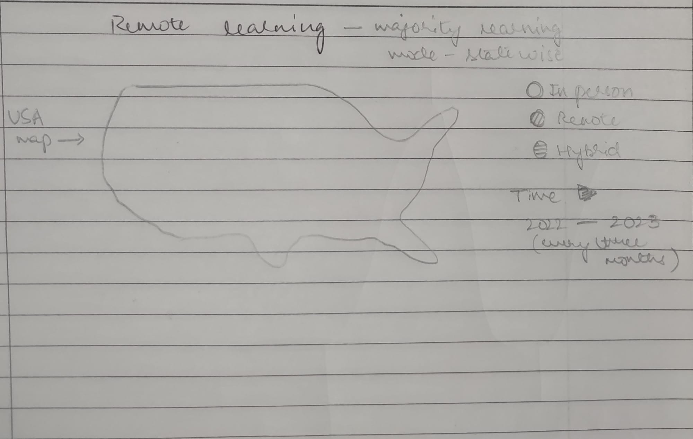

| [home page](https://pranavakadiyala.github.io/Portfolio/) | [visualizing debt](visualizing-government-debt) | [critique by design](critique-by-design) | [final project I](final-project-part-one) | [final project II](final-project-part-two) | [final project III](final-project-part-three) |

# Outline

The project analyses the continual impact of COVID-19 on school education. Beginning with the 2022 academic year, even though most schools have gone back to in person teaching, students behavioral and learning outcomes have continued to lag behind pre-COVID-19 rates. Through this project, I want to highlight how remote learning as a consequence of COVID-19 is associated with a stark decline in important student and education outcomes along with hetergenous effects across various community groups in the United States. The intention is to feature important new data on COVID-19's disruptions using a data visualization narrative style. 

### Structure

The project includes the following elements:
* Shift to remote learning - various methods of indtruction immediately adopted.
* Reduction in learning levels at grade (2020 - 2021)
* Mental health outcomes (2020 - 2021)
* Push to re-open schools with majority of them opening up for in-person teaching (2022)
* Lingering effects (2022 - 2023)
* Call to action - policy changes that can help improve learning and mental health outcomes

Story Arc:

1. One sentence summary of project
COVID-19 disruptions on school education has lingering impacts on students' learning and mental health outcomes.

2 and 3. What readers should understand? Call to action.
Various audience: a) Parents and Students: As a parent/student I want to qauntify the impact of COVID-19 on my/my children's learning and mental health outcomes so that I can use this information/data to advocate for improvements. I can do this by writing or mailing the local and/or federal policy makers for more resources and funding.
b) Government school officials and teachers. As a school official or teacher I want to see the impact of COVID-19 on students' learning and mental health outcomes so that I can take actions to improve mode of instructions, indtroduce new activities and find avenues for more funcing. I can do this by adding new learning programs, introducing mindfulness teaching, crowdfunding from general public or advocating for more funding for new resources.
c) Policy makers: As a policy maker I want to see the impact of COVID-19 on students' learning and mental health outcomes so that I can identify areas where students are lacking and judge requests for more funding. I can do this by increasing necessary fuding or mandating relevant improvements in instructional methods. 

# Initial sketches

The following sketches follow the progression of the various story elements mentioned above.

Change in learning/instructional methods.

Impact on learning outcomes over time.

Impact on lmental health.

# The data

I will rely on various data sources from the National Centre for Education Statistics (NCES) which is part of the Department of Education. NCES publishes data on education within the United States. I will primarily use the following three surveys from the NCES:
* School pulse panel data: Its a rapid response survey to collect data from government elementary, middle and high schools for the years 2019-2022 on a monthly basis. Includes data related to instruction activities, learining, mental health, behavioral outcomes, etc.
* School pre-assessment data: Data from surveys in seventh and eigth grade schools from December 2021 to february 2022 related to instuction and social distancing mandates and activities. 

Further, for more recent data, I will rely on databases curated by the Covid-19 School Data Hub. It provides additional avenues for data in case of missing data points in the NCES data. 

| Name | URL |
|------|-----|
| School Pulse Panel Data  | https://ies.ed.gov/schoolsurvey/    |
| School Pre-Assessment Data    | https://ies.ed.gov/schoolsurvey/    | 
| Covid-19 School Data Hub     | https://www.covidschooldatahub.com/data-resources    | 

# Method and medium

For this project, my primary mode of visual presentation will be shorthand. The shorthand website will serve as the platform for hosting all the final analyses and data visualizations. To create these data visuals, I will employ a combination of Flourish and Tableau, utilizing both tools for the initial sketches and final data visualizations. Based on my prior experience, using Flourish for initial sketches has proven effective in conveying the graph's intent more clearly and garnering valuable feedback. For data cleaning, processing, and analysis, I will rely on Python.
