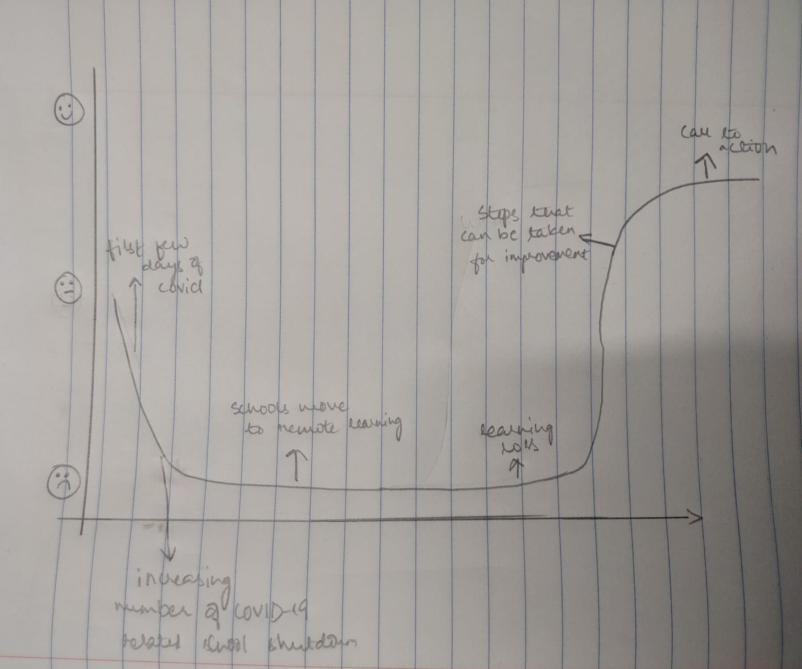

| [home page](https://pranavakadiyala.github.io/Portfolio/) | [visualizing debt](visualizing-government-debt) | [critique by design](critique-by-design) | [final project I](final-project-part-one) | [final project II](final-project-part-two) | [final project III](final-project-part-three) |

# Wireframes / storyboards

For this project, I aim to emphasize the significant learning deficit experienced by students in the US even as they were continuing to learn via remote education. Measuring and analyzing this learning loss and exploring strategies for improvement will help identify ways to update the existing approach for more effective outcomes.

As I was working on the project, I generated a new story arc that update on last week's submission. It has been updated keeping in mind the comments left by the instructor and data availability with the aim to develop a more targetted narrative and to develop a clear call to action. 

The story arc: 

Link to shorthand: https://preview.shorthand.com/jP2Zt9g1J7XmLXvH

# User research 

## Target audience

As mentioned in [part 1](final-project-part-one), there are three main audience for this story, in addition to the general audience who are regular news consumers and would be interested in knowing COVD-19's impact on education. 

Target audience:
* Parents/current students
* Teachers and government school officials
* Policy makers

However, I was unable to contact individuals with the above identifiable characteristics. Instead, I spoke with 3 individuals in their mid and late 20s who completed their elementary, secondary and high school education in the US. Both of them also completed their undergrad during COVID-19 and hence actively learnt using online methods. One of them also has a sibling who is currently in high school and was just beginning high school in 2020. Further, two of them worked with state and local governments on policy implementation questions. 

Hence, I feel like the two stakeholders - parents/current studetns and policy makers have been decently represented by the interviewees. However, as outlined in [part 1](final-project-part-one), since teachers have very similar goals and interested, I belive that overall the interviewers' feedback is pretty comprehensive and quite representative. 

## Interview script

| Goal | Questions to Ask |
|------|------------------|
| The story follows a narrative   | Do you think the storyboard follows a story?              |
| The graphs/visualizations are relevant    | Do you think the choice of charts and variables represented is relevant and appropriate?               |
| The message is clear    | What is the main take-away or message?                 |
| The story is relevant for the audeience  | Who do you think is audience of this story? |
| To understand if anything is standing out - to check if what needs to be emphasized is being emphasized | Anything that stands out to you? Or is confusing? |
| Direct feedback | What would you change? |

Script/How the interviews were conducted:
When conducting the interviews, I give very little background. I just start showing them the preview for the shorthand. If there are any questions or queries about anything - like what is the graph showing, etc, I note them down against the question or goal its connected to and answer them. After they are done scrolling, I ask them questions in the order written above. 

## Interview findings

| Questions               | Interview 1 (late 20s, worked with local government) | Interview 2 (mid 20s, worked with government, attending college during covid, worked with government, has a sibling currently going to high school) | Interview 3 (early 20s, attending college during covid, interested in education policy |
|-------------------------|--------------------------------|-------------|-------------|
| Do you think the storyboard follows a story? | Yes, overall pretty good, but when the charts about math come into the picture, its abrupt             | Yes, follows a chornological order and discussion of cause and effect           | Yes, there seems to be a consistent theme too which is nice            |
| Do you think the choice of charts and variables represented is relevant and appropriate?                      | Add subjects, right now only talking about math. The closure duration chart, its too big not able to see X-axis and condense to a single bar.                              | Fix map animation, make the closure duration small, while scrolling you can't see the axis for a while           | Add more subjects, need additional variables            |
|                         |                                |             |             |

# Identified changes for Part III
> Document the changes you plan on implementing next week to address any issues identified.  

Text here!

| Research synthesis                       | Anticipated changes for Part III                                                |
|------------------------------------------|---------------------------------------------------------------------------------|
| Findings or observations from interviews | Describe what, if any changes you anticipate making to address the observation. |
|                                          |                                                                                 |
|                                          |                                                                                 |
|                                          |                                                                                 |
| ...add more rows as necessary            |                                                                                 |

> ...include any final thoughts you have here. 

Text here!
